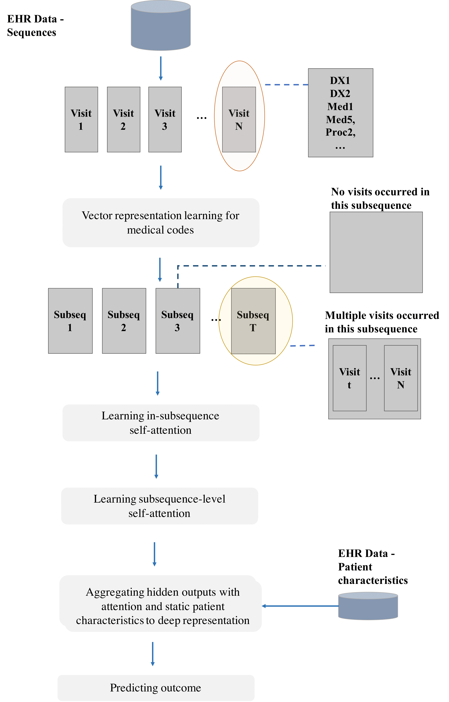

|DOI| |arxiv| |license| |twitter|

Patient2Vec: A Personalized Interpretable Deep Representation of the Longitudinal Electronic Health Record
===========================================================================================================

Referenced paper : `Patient2Vec: A Personalized Interpretable Deep Representation of the Longitudinal Electronic Health Record <https://doi.org/10.1109/ACCESS.2018.2875677>`__

|Patient2Vec|

Documentation
=============

The wide implementation of electronic health record (EHR) systems facilitates the collection of large-scale health data from real clinical settings. Despite the significant increase in adoption of EHR systems, this data remains largely unexplored, but presents a rich data source for knowledge discovery from patient health histories in tasks such as understanding disease correlations and predicting health outcomes. However, the heterogeneity, sparsity, noise, and bias in this data present many complex challenges. This complexity makes it difficult to translate potentially relevant information into machine learning algorithms. In this paper, we propose a computational framework, Patient2Vec, to learn an interpretable deep representation of longitudinal EHR data which is personalized for each patient. To evaluate this approach, we apply it to the prediction of future hospitalizations using real EHR data and compare its predictive performance with baseline methods. Patient2Vec produces a vector space with meaningful structure and it achieves an AUC around 0.799 outperforming baseline methods. In the end, the learned feature importance can be visualized and interpreted at both the individual and population levels to bring clinical insights.

.. |DOI| image:: https://img.shields.io/badge/DOI-10.1109/ACCESS.2018.2875677-blue.svg?style=flat
   :target: https://doi.org/10.1109/ACCESS.2018.2875677
.. |arxiv| image:: https://img.shields.io/badge/arXiv-1810.04793-red.svg
    :target: https://arxiv.org/abs/1810.04793

.. |license| image:: https://img.shields.io/github/license/mashape/apistatus.svg?maxAge=2592104
   :target: https://github.com/BarnesLab/Patient2Vec/blob/master/LICENSE
.. |twitter| image:: https://img.shields.io/twitter/url/http/shields.io.svg?style=social
   :target: https://twitter.com/intent/tweet?text=Patient2Vec:%20A%20Personalized%20Interpretable%20Deep%20Representation%20of%20the%20Longitudinal%20Electronic%20Health%20Record%0aGitHub:&url=https://github.com/BarnesLab/Patient2Vec&hashtags=healthcare,DeepLearning,hospitalization,EHR,Electronic,Health,Record,representation,learning,personalization
   
   
Citation:
========

.. code::

   @ARTICLE{Patient2Vec, 
         author={Zhang, Jinghe and Kowsari, Kamran and Harrison, James H and Lobo, Jennifer M and Barnes, Laura E}, 
         journal={IEEE Access}, 
         title={Patient2Vec: A Personalized Interpretable Deep Representation of the Longitudinal Electronic Health Record}, 
         year={2018}, 
         volume={6}, 
         pages={65333-65346}, 
         doi={10.1109/ACCESS.2018.2875677}, 
         ISSN={2169-3536}
   }
